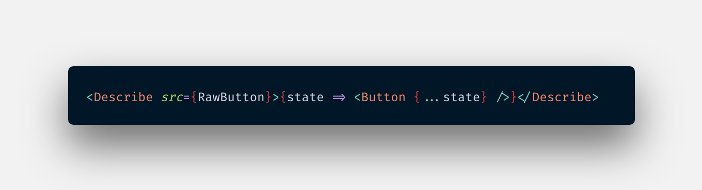
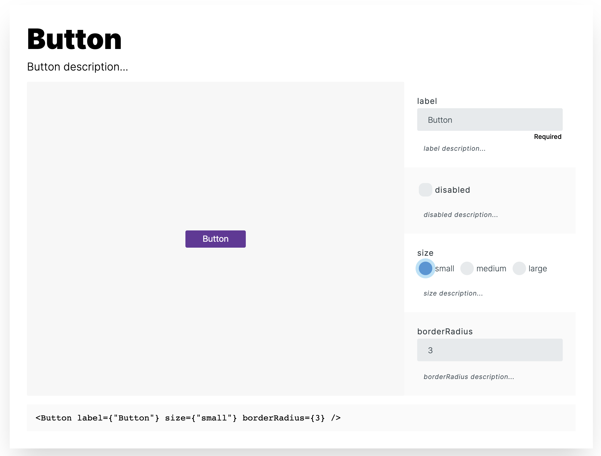

# React Describe

`React Describe` generates a component playground with editable prop values and a live preview that you can include in your own docs.





| Table of Contents                       |
| :-------------------------------------- |
| [Runnable examples](#runnable-examples) |
| [Installation](#installation)           |
| [Usage](#usage)                         |
| [Licensing](#licensing)                 |

## Runnable examples

- [Basic](https://codesandbox.io/s/react-describe-example-cw9b8)
- [Gatsby](https://codesandbox.io/s/react-describe-gatsby-example-6x1qw)

## Installation

with Yarn:

```bash
yarn add react-describe
```

with npm:

```bash
npm install react-describe
```

## Usage

- Define `propTypes` and `defaultProps` for your component props
- Add a comment above each prop to describe it

```js
import React from "react";
import PropTypes from "prop-types";

/**
 * Button description...
 */
export default function Button({ label, disabled, size, borderRadius }) {
  const sizes = {
    small: 32,
    medium: 48,
    large: 64
  };

  return (
    <button
      style={{
        paddingLeft: sizes[size],
        paddingRight: sizes[size],
        fontSize: sizes[size] / 2,
        height: sizes[size],
        backgroundColor: "rebeccapurple",
        color: "#fff",
        border: "none",
        borderRadius,
        opacity: disabled ? 0.5 : 1
      }}
      disabled={disabled}
    >
      {label}
    </button>
  );
}

Button.defaultProps = {
  size: "medium",
  disabled: false,
  borderRadius: 0
};

Button.propTypes = {
  /**
   * label description...
   */
  label: PropTypes.string.isRequired,

  /**
   * disabled description...
   */
  disabled: PropTypes.bool,

  /**
   * size description...
   */
  size: PropTypes.oneOf(["small", "medium", "large"]),

  /**
   * borderRadius description...
   */
  borderRadius: PropTypes.number
};
```

- Import `react-describe`
- Import your component and place it as child of `Describe`
- Import your component as a string and pass it to `src`

```js
import React from "react";
import ReactDOM from "react-dom";
import { Describe } from "react-describe";
import Button from "./Button";
import RawButton from "!raw-loader!./Button.js";

function App() {
  return (
    <div className="App">
      <Describe src={RawButton}>{state => <Button {...state} />}</Describe>
    </div>
  );
}

const rootElement = document.getElementById("root");
ReactDOM.render(<App />, rootElement);
```

- You can provide an initial state to override default prop values

```js
<Describe
  src={RawButton}
  initialState={{
    label: "Button",
    disabled: true,
    size: "small",
    borderRadius: 3
  }}
>
  {state => <Button {...state} />}
</Describe>
```

### Available playground inputs

| PropType | input              |
| :------- | ------------------ |
| string   | text input         |
| number   | number input       |
| bool     | checkbox           |
| oneOf    | radio-button group |

## Licensing

React Describe is licensed under the [MIT License](LICENSE)
